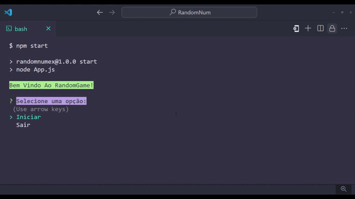

# RandomNum 🎲

> "RandomGame" é um jogo de adivinhação de números desenvolvido em Javascript, utilizando as bibliotecas 'inquirer' (na versão 4.1.2) e chalk (na versão 8.2.6). O objetivo é advinhar um número aleatório entre 1 e 20, com um total de 4 tentativas.

## Demonstração
Veja como o RandomGame Funciona:

